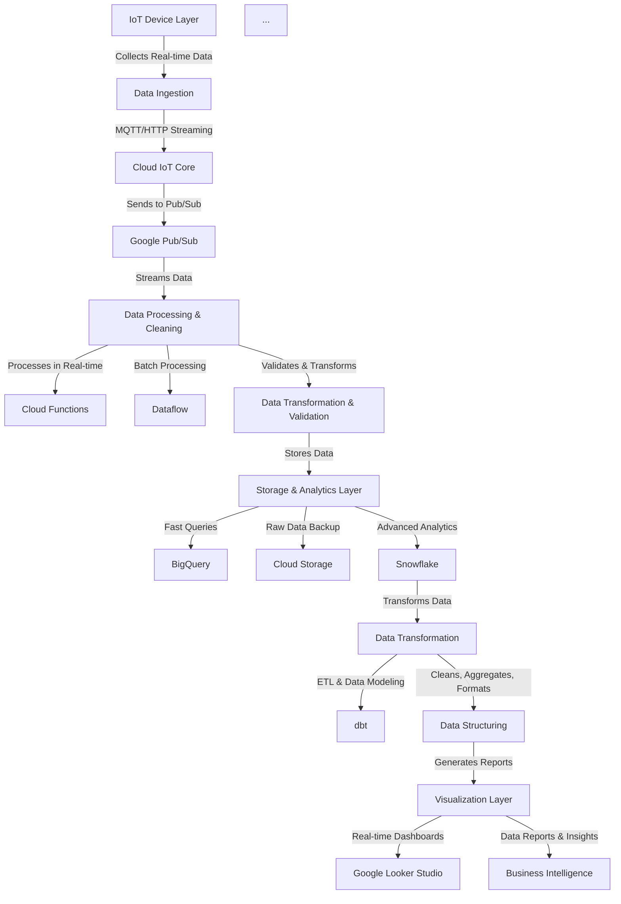

---

# QR Code Generator using Streamlit

## Overview

This project is a simple QR code generator built using Streamlit, a popular Python library for creating web apps with minimal effort. With this tool, users can easily generate QR codes for various purposes such as sharing links, contact information, or any other text-based data.


## Features

- Generate QR codes for text-based data.
- Customize QR code size and color.
- Download generated QR codes as image files.

## Installation

To use this QR code generator, follow these steps:

1. Clone this repository to your local machine:

   ```
   https://github.com/Nikhilsuresh11/Qr-code-generator.git
   ```

2. Navigate to the project directory:

   ```
   cd qr-code-generator
   ```

3. Install the required dependencies:

   ```
   pip install -r requirements.txt
   ```

## Usage

To run the QR code generator app, execute the following command:

```
streamlit run QR.py
```

Once the Streamlit server is running, open your web browser and navigate to the provided URL (usually `http://localhost:8501`). You will see the QR code generator interface where you can input your data and customize the QR code as needed.
